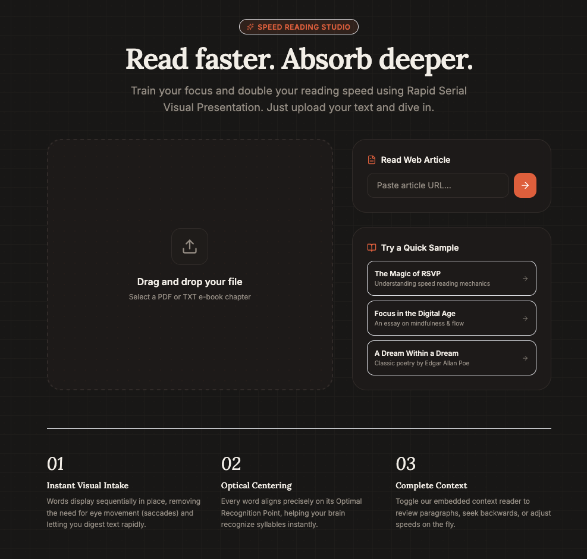
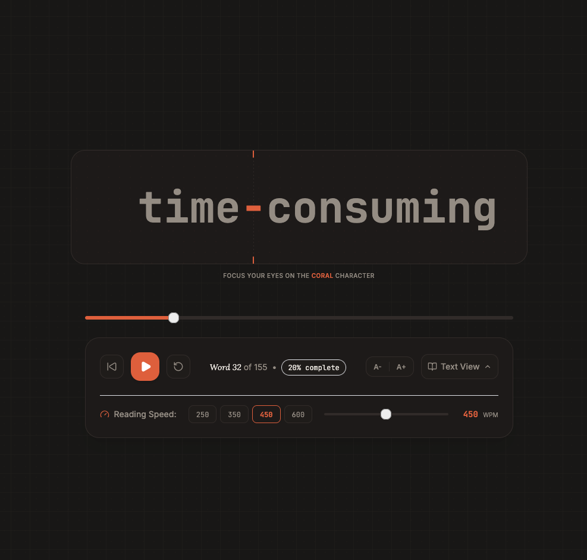

So there I was, scrolling through reels, when I came across one claiming that humans can read at **400-800 words per minute**.

Naturally I was curious.

The reel talked about something called **RSVP (Rapid Serial Visual Presentation)**. Instead of reading lines of text, it flashes one word at a time at the same spot on the screen. Since your eyes don't have to keep jumping from word to word, apparently your brain can process text much faster.

That got me curious!

So instead of spending an hour reading about it...

I spent a couple of hours building it.

 **https://baliga.dev/readfaster/**

---

## Wait... did that actually work?

hmmm.... interesting

The above was my initial reaction.

And no, its not *"I'll finish Harry Potter in 30 minutes"* kind of yes.

But I was okay-ishly reading at around **450-500 WPM**, way more than my normal reading speed.

The weird part wasn't that it felt fast.

It was how quickly my brain adapted.

After a few seconds, I stopped consciously reading individual words and just... understood the sentences.

It was surprising.

---

## Why is normal reading slower?

Naturally I doubled down and dug deeper to find out the how and why.
When you read normally, your eyes are constantly moving.

Read a few words.

Jump.

Read a few more.

Jump again.

Sometimes even jump backwards because you missed something.

Every one of those tiny eye movements takes time.

RSVP removes almost all of that.

Since every word appears at exactly the same position, your eyes barely need to move. Your brain spends less effort finding the next word and more effort processing what it's reading.

---

## But should you read everything this fast?

Definitely not.

Just because you *can* read at 500 WPM doesn't mean you should.
This just felt like an amusing experiment, like you lose interest after 10 mins or so.

If I'm reading documentation, blog posts or articles? It's amazing. I just want the information as quickly as possible.

But imagine reading a book this way.

The suspense.

The emotions.

The audible gasps we make after reading a plot twist.

They all disappear.

You technically read the story, but we wont really *experience* it.
Some things doesn't need efficiency or needs to be performative. 

Slowing down is part of understanding.

RSVP feels less like a replacement for normal reading and more like another tool. Perfect for skimming through information. Terrible for soaking in a good story.

---

## Building it

The implementation itself was surprisingly simple.

A textarea.

A play button.

A WPM slider.

Split the text into words.

Display one word at a fixed interval.

The fun part was polishing the tiny details.

* Pause and resume.
* Progress tracking.
* Keyboard shortcuts.
* A clean distraction-free UI.
* Making it feel smooth instead of like a PowerPoint presentation.

It's one of those projects that's small enough to finish in an evening, but interesting enough that you end up learning something along the way. And of course I used ai to build the website, cus why not? its a simple and small project!

---

Lately, I've been feeling a little burned out.

Ever since AI coding agents became part of my daily workflow, I've noticed something strange.

I'm building more things than ever.

But it doesn't always feel like **I'm** the one building them.

Somewhere along the way, work felt less like a creative endeavor and more like a series of tasks to complete.

That's one of the reasons I wanted to build this.

Nobody needs this website to be built
I just saw something interesting, got curious, and wanted to build it.

I'm trying to "fall in love" with coding again.

I build for fun.
Some of them probably won't even be useful next week.

But every once in a while, a random idea from a reel turns into a tiny project that teaches me something new.

And honestly, I think that's enough.

If you want to see how fast your brain can keep up, give it a try:

👉 **https://baliga.dev/readfaster/**
